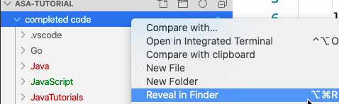

Tutorial – Algorand Standard Assets (ASA)
=========================================

The Algorand platform is a general-purpose economic exchange system which
represents an extremely broad market. A given platform’s attractiveness and
effectiveness as a means of economic exchange can be defined by the combination
of what you can own and how you can transact.

Algorand Standard Assets represents Algorand’s ability to digitize any asset and
have both it and its ownership represented on chain. These assets could be
fungible (for example: currencies, stable coins, loyalty points, system credits,
in-game points, etc) or non-fungible (for example: real estate, collectables,
supply chain, in-game items, tickets, etc). In addition, our functionality
allows restrictions to be placed on the assets where needed (for example:
securities, certifications, compliance, etc).

Algorand has implemented named assets as a truly layer 1 asset. This allows any
asset created on Algorand to enjoy:

**Increased security** - New assets will enjoy the same security and safety as
Algos, the native currency on Algorand

**Inherent compatibility** - Apps that support any Algorand asset will support
all Algorand assets

**High ease of use** - Create your asset with a single transaction to the
network

Step 1 Setup Accounts, Utility Functions and Tools
--------------------------------------------------

This tutorial will use three TestNet accounts that have been pre-created. It is
possible that these accounts may run out of Algos and you would need to dispense
more funds using the TestNet Dispenser.

The TestNet dispenser is located here:
<https://bank.testnet.algorand.network/>

The accounts used in this tutorial are:
THQHGD4HEESOPSJJYYF34MWKOI57HXBX4XR63EPBKCWPOJG5KUPDJ7QJCM
AJNNFQN7DSR7QEY766V7JDG35OPM53ZSNF7CU264AWOOUGSZBMLMSKCRIU
3ZQ3SHCYIKSGK7MTZ7PE7S6EDOFWLKDQ6RYYVMT7OHNQ4UJ774LE52AQCU

!!! info
    You may want to verify account information periodically as well as transactions
    with asset information during the course of this tutorial. You can use either
    the [Algo TestNet Explorer](https://testnet.algoexplorer.io/) or use the Purestake's [Goalseeker](https://goalseeker.purestake.io/algorand/testnet), which also
    facilitates search by asset ID.

<!--  to search on Address,
Transaction, Block or AssetID](../imgs/TutorialASA-01.png) -->

<center></center>
<center>**Figure Step 1-1** Use Purestake’s Goalseeker to search Address,
Transaction, Block or AssetID.</center>

!!! info
    See the appropriate GitHub repository for installing the SDKs:

    [JavaScript](https://github.com/algorand/js-algorand-sdk)

    [Python](https://github.com/algorand/py-algorand-sdk)

    [Java](https://github.com/algorand/java-algorand-sdk)

    [Go Lang](https://github.com/algorand/go-algorand-sdk)


!!! info
    If you do not have a node setup, see these [instructions](https://developer.algorand.org/docs/introduction-installing-node). Also, another alternative is to use [PureStake](https://www.purestake.com/).

Now for the code. The tutorial code below is separated into snippets categorized by ASA core functions, but is laid out in order and should be coded as a single script for each respective language. 

So, first create an empty code file for desired language of choice (TutorialASA.js, TutorialASA.py, TutorialASA.java, or TutorialASA.go). Then simply append the each snippet after the last line of code in the prior step as you read through this tutorial.

```javascript tab="JavaScript"

const algosdk = require('algosdk');
//Retrieve the token, server and port values for your installation in the algod.net
//and algod.token files within the data directory
// UPDATE THESE VALUES
const token = "TOKEN";
const server = "SERVER";
const port = PORT;
// Structure for changing blockchain params
var cp = {
fee: 0,
firstRound: 0,
lastRound: 0,
genID: "",
genHash: ""
}

// Utility function to update params from blockchain
var getChangingParms = async function( algodclient ) {
let params = await algodclient.getTransactionParams();
cp.firstRound = params.lastRound;
cp.lastRound = cp.firstRound + parseInt(1000);
let sfee = await algodclient.suggestedFee();
cp.fee = sfee.fee;
cp.genID = params.genesisID;
cp.genHash = params.genesishashb64;
}

// Function used to wait for a tx confirmation
var waitForConfirmation = async function(algodclient, txId) {
while (true) {
b3 = await algodclient.pendingTransactionInformation(txId);
if (b3.round != null && b3.round \> 0) {
//Got the completed Transaction
console.log("Transaction " + b3.tx + " confirmed in round " + b3.round);
break;
}
}
};

// Recover accounts used in example

var account1_mnemonic = "portion never forward pill lunch organ biology" +
" weird catch curve isolate plug innocent skin grunt" +
" bounce clown mercy hole eagle soul chunk type absorb trim";
var account2_mnemonic = "place blouse sad pigeon wing warrior wild script" +
" problem team blouse camp soldier breeze twist mother" +
" vanish public glass code arrow execute convince ability" +
" there";
var account3_mnemonic = "image travel claw climb bottom spot path roast" +
" century also task cherry address curious save item" +
" clean theme amateur loyal apart hybrid steak about blanket"
var recoveredAccount1 = algosdk.mnemonicToSecretKey(account1_mnemonic);
var recoveredAccount2 = algosdk.mnemonicToSecretKey(account2_mnemonic);
var recoveredAccount3 = algosdk.mnemonicToSecretKey(account3_mnemonic);
console.log(recoveredAccount1.addr);
console.log(recoveredAccount2.addr);
console.log(recoveredAccount3.addr);
// Instantiate the algod wrapper
let algodclient = new algosdk.Algod(token, server, port);
//console/terminal output should look similar to this
//THQHGD4HEESOPSJJYYF34MWKOI57HXBX4XR63EPBKCWPOJG5KUPDJ7QJCM
//AJNNFQN7DSR7QEY766V7JDG35OPM53ZSNF7CU264AWOOUGSZBMLMSKCRIU
//3ZQ3SHCYIKSGK7MTZ7PE7S6EDOFWLKDQ6RYYVMT7OHNQ4UJ774LE52AQCU
```

```python tab="Python"

import json
from algosdk import account, algod, mnemonic, transaction
# Shown for demonstration purposes. NEVER reveal secret mnemonics in practice.
# Change these values if you want to use different accounts.
mnemonic1 = "portion never forward pill lunch organ biology weird catch curve isolate plug innocent skin grunt bounce clown mercy hole eagle soul chunk type absorb trim"
mnemonic2 = "place blouse sad pigeon wing warrior wild script problem team blouse camp soldier breeze twist mother vanish public glass code arrow execute convince ability there"
mnemonic3 = "image travel claw climb bottom spot path roast century also task cherry address curious save item clean theme amateur loyal apart hybrid steak about blanket"

# For ease of reference, add account public and private keys to
# an accounts dict.

accounts = {}
counter = 1
for m in [mnemonic1, mnemonic2, mnemonic3]:
accounts[counter] = {}
accounts[counter]['pk'] = mnemonic.to_public_key(m)
accounts[counter]['sk'] = mnemonic.to_private_key(m)

counter += 1
# Specify your node address and token. This must be updated.
# algod_address = "" \# ADD ADDRESS
# algod_token = "" \# ADD TOKEN

algod_address = "http://hackathon.algodev.network:9100"
algod_token = "ef920e2e7e002953f4b29a8af720efe8e4ecc75ff102b165e0472834b25832c1"

# Initialize an algod client
algod_client = algod.AlgodClient(algod_token, algod_address)
# Get network params for transactions.
params = algod_client.suggested_params()
first = params.get("lastRound")
last = first + 1000
gen = params.get("genesisID")
gh = params.get("genesishashb64")
min_fee = params.get("minFee")
# Utility function to wait for a transaction to be confirmed by network
def wait_for_tx_confirmation(txid):
# Wait until the transaction's round info is confirmed, i.e. no longer 0
pendinginfo = algod_client.pending_transaction_info(txid)
while pendinginfo['round'] == 0:
pendinginfo = algod_client.pending_transaction_info(txid)
print("Account 1 address: {}".format(accounts[1]['pk']))
print("Account 2 address: {}".format(accounts[2]['pk']))
print("Account 3 address: {}".format(accounts[3]['pk']))


# your terminal output should look similar to the following

# Account 1 account: THQHGD4HEESOPSJJYYF34MWKOI57HXBX4XR63EPBKCWPOJG5KUPDJ7QJCM
# Account 2 account: AJNNFQN7DSR7QEY766V7JDG35OPM53ZSNF7CU264AWOOUGSZBMLMSKCRIU
# Account 3 account: 3ZQ3SHCYIKSGK7MTZ7PE7S6EDOFWLKDQ6RYYVMT7OHNQ4UJ774LE52AQCU
```

```java tab="Java"
package com.algorand.Tutorials;
import java.math.BigInteger;
import java.util.ArrayList;
import java.util.List;
import java.util.Map;
import java.util.TreeMap;
import java.util.Map.Entry;
import com.algorand.algosdk.account.Account;
import com.algorand.algosdk.algod.client.AlgodClient;
import com.algorand.algosdk.algod.client.ApiException;
import com.algorand.algosdk.algod.client.api.AlgodApi;
import com.algorand.algosdk.algod.client.auth.ApiKeyAuth;
import com.algorand.algosdk.algod.client.model.AssetParams;
import com.algorand.algosdk.algod.client.model.TransactionID;
import com.algorand.algosdk.algod.client.model.TransactionParams;
import com.algorand.algosdk.crypto.Address;
import com.algorand.algosdk.crypto.Digest;
import com.algorand.algosdk.transaction.SignedTransaction;
import com.algorand.algosdk.transaction.Transaction;
import com.algorand.algosdk.util.Encoder;

// To be completed... Creating, modifying, sending and listing assets

public class TutorialASAJava {
// Inline class to handle changing block parameters
// Throughout the example
static class ChangingBlockParms {
public BigInteger fee;
public BigInteger firstRound;
public BigInteger lastRound;
public String genID;
public Digest genHash;
public ChangingBlockParms() {
this.fee = BigInteger.valueOf(0);
this.firstRound = BigInteger.valueOf(0);
this.lastRound = BigInteger.valueOf(0);
this.genID = "";
this.genHash = null;
}
};

// Utility function to wait on a transaction to be confirmed

private static void waitForTransactionToComplete(AlgodApi algodApiInstance,
String txID) throws Exception {
while (true) {
try {
// Check the pending tranactions
com.algorand.algosdk.algod.client.model.Transaction b3 = algodApiInstance.pendingTransactionInformation(txID);
if (b3.getRound() != null && b3.getRound().longValue() \> 0) {
// Got the completed Transaction
System.out.println("Transaction " + b3.getTx() + " confirmed in round " +b3.getRound().longValue());
break;
}
} catch (Exception e) {
throw (e);
}
}
}

// Utility function to update changing block parameters

public static ChangingBlockParms getChangingParms(AlgodApi algodApiInstance)
throws Exception {
ChangingBlockParms cp = new TutorialASAJava.ChangingBlockParms();
try {
TransactionParams params = algodApiInstance.transactionParams();
cp.fee = params.getFee();
cp.firstRound = params.getLastRound();
cp.lastRound = cp.firstRound.add(BigInteger.valueOf(1000))
cp.genID = params.getGenesisID();
cp.genHash = new Digest(params.getGenesishashb64());
} catch (ApiException e) {
throw (e);
}
return (cp);
}

// Utility function for sending a raw signed transaction to the network
public static TransactionID submitTransaction(AlgodApi algodApiInstance,
SignedTransaction signedTx)
throws Exception {
try {
// Msgpack encode the signed transaction
byte[] encodedTxBytes = Encoder.encodeToMsgPack(signedTx)
TransactionID id = algodApiInstance.rawTransaction(encodedTxBytes);
return (id);
} catch (ApiException e) {
throw (e);
}
}

public static void main(String args[]) throws Exception {
final String ALGOD_API_ADDR = "NODEADDRESS";
final String ALGOD_API_TOKEN = "NODETOKEN";
AlgodClient client = (AlgodClient) new
AlgodClient().setBasePath(ALGOD_API_ADDR);
ApiKeyAuth api_key = (ApiKeyAuth) client.getAuthentication("api_key");
api_key.setApiKey(ALGOD_API_TOKEN);
AlgodApi algodApiInstance = new AlgodApi(client);
// Shown for demonstration purposes. NEVER reveal secret mnemonics in practice.
// These three accounts are for testing purposes

final String account1_mnemonic = "portion never forward pill lunch organ biology"
\+ " weird catch curve isolate plug innocent skin grunt"
\+ " bounce clown mercy hole eagle soul chunk type absorb trim";
final String account2_mnemonic = "place blouse sad pigeon wing warrior wild script"
\+ " problem team blouse camp soldier breeze twist mother"
\+ " vanish public glass code arrow execute convince ability" + " there";
final String account3_mnemonic = "image travel claw climb bottom spot path roast"
\+ "century also task cherry address curious save item "
\+ "clean theme amateur loyal apart hybrid steak about blanket";
Account acct1 = new Account(account1_mnemonic);
Account acct2 = new Account(account2_mnemonic);
Account acct3 = new Account(account3_mnemonic);

// get last round and suggested tx fee
// We use these to get the latest round and tx fees
// These parameters will be required before every
// Transactio
// We will account for changing transaction parameters
// before every transaction in this example

ChangingBlockParms cp = null;
try {
cp = getChangingParms(algodApiInstance);
} catch (ApiException e) {
e.printStackTrace();
return;
}
System.out.println(acct1.getAddress().toString())
System.out.println(acct2.getAddress().toString());
System.out.println(acct3.getAddress().toString());
}
}

// Terminal should look similar to this:
// THQHGD4HEESOPSJJYYF34MWKOI57HXBX4XR63EPBKCWPOJG5KUPDJ7QJCM
// AJNNFQN7DSR7QEY766V7JDG35OPM53ZSNF7CU264AWOOUGSZBMLMSKCRIU
// 3ZQ3SHCYIKSGK7MTZ7PE7S6EDOFWLKDQ6RYYVMT7OHNQ4UJ774LE52AQCU

```

```go tab="Go"

package main

import (
// b64 "encoding/base64"
json "encoding/json"
"fmt"
"github.com/algorand/go-algorand-sdk/client/algod"
// "github.com/algorand/go-algorand-sdk/crypto"
"github.com/algorand/go-algorand-sdk/mnemonic"
// "github.com/algorand/go-algorand-sdk/transaction"
)

// UPDATE THESE VALUES
const algodAddress = "ADDRESS"
const algodToken = "TOKEN"

var txHeaders = append([]\*algod.Header{}, &algod.Header{"Content-Type","application/json"})
// Accounts to be used through examples
func loadAccounts() (map[int][]byte, map[int]string) {
// Shown for demonstration purposes. NEVER reveal secret mnemonics in practice.
// Change these values if you want to use different accounts.
var pks = map[int]string{
1: "THQHGD4HEESOPSJJYYF34MWKOI57HXBX4XR63EPBKCWPOJG5KUPDJ7QJCM",
2: "AJNNFQN7DSR7QEY766V7JDG35OPM53ZSNF7CU264AWOOUGSZBMLMSKCRIU",
3: "3ZQ3SHCYIKSGK7MTZ7PE7S6EDOFWLKDQ6RYYVMT7OHNQ4UJ774LE52AQCU",
}

mnemonic1 := "portion never forward pill lunch organ biology weird catch curve isolate plug innocent skin grunt bounce clown mercy hole eagle soul chunk type absorb trim"
mnemonic2 := "place blouse sad pigeon wing warrior wild script problem team blouse camp soldier breeze twist mother vanish public glass code arrow execute convince ability there"
mnemonic3 := "image travel claw climb bottom spot path roast century also task cherry address curious save item clean theme amateur loyal apart hybrid steak about blanket"
mnemonics := []string{mnemonic1, mnemonic2, mnemonic3}
var sks = make(map[int][]byte)
for i, m := range mnemonics {
var err error
sks[i+1], err = mnemonic.ToPrivateKey(m)
if err != nil {
fmt.Printf("Issue with account %d private key conversion.", i+1)
} else {
fmt.Printf("Loaded Key %d: %s\\n", i+1, pks[i+1])
}
}
return sks, pks
}
// Function that waits for a given txId to be confirmed by the network
func waitForConfirmation(algodClient algod.Client, txId string) {
for {
b3, err := algodClient.PendingTransactionInformation(txId, txHeaders...)
if err != nil {
fmt.Printf("waiting for confirmation... (pool error, if any): %s\\n", err)
continue
}
if b3.ConfirmedRound \> 0 {
fmt.Printf("Transaction "+b3.TxID+" confirmed in round %d\\n",
b3.ConfirmedRound)
break
}
}
}

// Pretty prints Go structs
func PrettyPrint(data interface{}) {
var p []byte
// var err := error
p, err := json.MarshalIndent(data, "", "\\t")
if err != nil {
fmt.Println(err)
return
}
fmt.Printf("%s \\n", p
}

// Main function to demonstrate ASA examples

func main() {
// Get pre-defined set of keys for example
sks, pks := loadAccounts(
// Initialize an algodClien
algodClient, err := algod.MakeClient(algodAddress, algodToken
if err != nil 
return
// Get network-related transaction parameters and assign
txParams, err := algodClient.SuggestedParams()
if err != nil {
fmt.Printf("error getting suggested tx params: %s\\n", err)
return
}

// Print asset info for newly created asset.
PrettyPrint(txParams)
PrettyPrint(sks)
PrettyPrint(pks)
}

//Your console/terminal outpur should look similar to this...

// Loaded Key 1: THQHGD4HEESOPSJJYYF34MWKOI57HXBX4XR63EPBKCWPOJG5KUPDJ7QJCM
// Loaded Key 2: AJNNFQN7DSR7QEY766V7JDG35OPM53ZSNF7CU264AWOOUGSZBMLMSKCRIU
// Loaded Key 3: 3ZQ3SHCYIKSGK7MTZ7PE7S6EDOFWLKDQ6RYYVMT7OHNQ4UJ774LE52AQCU

// {
// "fee": 1,
// "genesisID": "testnet-v1.0",
// "genesishashb64": "SGO1GKSzyE7IEPItTxCByw9x8FmnrCDexi9/cOUJOiI="
// "lastRound": 4268229,
// "consensusVersion": "https://github.com/algorandfoundation/specs/tree/4a9db6a25595c6fd097cf9cc137cc83027787eaa"
// }

// {
// "1":"QkWlt0yawnHOIvkgkQ3tbEo6KudsGmDRYtlQ1OeieN2Z4HMPhyEk58kpxgu+MspyO/PcN+Xj7ZHhUKz3JN1VHg==",
// "2":"Lg1Ge0vafd1jv8FbrXcwDEJnbnA9kIpH68XQUoY88SUCWtLBvxyj+BMf96v0jNvrns7vMml+KmvcBZzqGlkLFg==",
// "3":"iuM5VLAiDUsfFLsr0QG8d7KB1/jXdlIBeA9IKAXAoXreYbkcWEKkZX2Tz95Py8Qbi2WocPRxirJ/cdsOUT//Fg=="
// }
// {
// "1": "THQHGD4HEESOPSJJYYF34MWKOI57HXBX4XR63EPBKCWPOJG5KUPDJ7QJCM",
// "2": "AJNNFQN7DSR7QEY766V7JDG35OPM53ZSNF7CU264AWOOUGSZBMLMSKCRIU",
// "3": "3ZQ3SHCYIKSGK7MTZ7PE7S6EDOFWLKDQ6RYYVMT7OHNQ4UJ774LE52AQCU"
// }
```

Step 2 Create a New Asset
---------------------------

Account 1 creates an asset called latinum and sets Account 2 as the manager, reserve, freeze, and clawback address.

!!! note
	With the **Go** code solution, you will need to paste this snippet before the final curly brace ```}``` and uncommnet the import libraries at the top as needed.
    
    With the **Java** code solution, you will need to paste this snippet at the end of the ```main``` function, before the final two curly braces ```}}```

```javascript tab="JavaScript"
(async () => {
    // Asset Creation:
    // The first transaciton is to create a new asset
    // Get last round and suggested tx fee
    // We use these to get the latest round and tx fees
    // These parameters will be required before every 
    // Transaction
    // We will account for changing transaction parameters
    // before every transaction in this example
    await getChangingParms(algodclient);
    let note = undefined; // arbitrary data to be stored in the transaction; here, none is stored
    //Asset creation specific parameters
    // The following parameters are asset specific
    // Throughout the example these will be re-used. 
    // We will also change the manager later in the example
    let addr = recoveredAccount1.addr;
    // Whether user accounts will need to be unfrozen before transacting    
    let defaultFrozen = false;
    // integer number of decimals for asset unit calculation
    let decimals = 0;
    // total number of this asset available for circulation   
    let totalIssuance = 1000;
    // Used to display asset units to user    
    let unitName = "LATINUM";
    // Friendly name of the asset    
    let assetName = "latinum";
    // Optional string pointing to a URL relating to the asset
    let assetURL = "http://someurl";
    // Optional hash commitment of some sort relating to the asset. 32 character length.
    let assetMetadataHash = "16efaa3924a6fd9d3a4824799a4ac65d";
    // The following parameters are the only ones
    // that can be changed, and they have to be changed
    // by the current manager
    // Specified address can change reserve, freeze, clawback, and manager
    let manager = recoveredAccount2.addr;
    // Specified address is considered the asset reserve
    // (it has no special privileges, this is only informational)
    let reserve = recoveredAccount2.addr;
    // Specified address can freeze or unfreeze user asset holdings 
    let freeze = recoveredAccount2.addr;
    // Specified address can revoke user asset holdings and send 
    // them to other addresses    
    let clawback = recoveredAccount2.addr;

    // signing and sending "txn" allows "addr" to create an asset
    let txn = algosdk.makeAssetCreateTxn(addr, cp.fee, cp.firstRound, cp.lastRound, note,
        cp.genHash, cp.genID, totalIssuance, decimals, defaultFrozen, manager, reserve, freeze,
        clawback, unitName, assetName, assetURL, assetMetadataHash);

    let rawSignedTxn = txn.signTxn(recoveredAccount1.sk)
    let tx = (await algodclient.sendRawTransaction(rawSignedTxn));
    console.log("Transaction : " + tx.txId);
    let assetID = null;
    // wait for transaction to be confirmed
    await waitForConfirmation(algodclient, tx.txId);
    // Get the new asset's information from the creator account
    let ptx = await algodclient.pendingTransactionInformation(tx.txId);
    assetID = ptx.txresults.createdasset;
    console.log("AssetID = " + assetID);

    // your terminal/console output should be similar to this
    // Transaction: RXSAJUYVPDWUF4XNGA2VYQX3NUVT5YJEZZ5SJXIIASZK5M55LVVQ
    // Transaction RXSAJUYVPDWUF4XNGA2VYQX3NUVT5YJEZZ5SJXIIASZK5M55LVVQ confirmed in round 4272786
    // AssetID = 149657

})().catch(e => {
    console.log(e);
    console.trace();
});

```

```python tab="Python"
# insert after step 1 code
# Account 1 creates an asset called latinum and sets Account 2 as the manager, reserve, freeze, and clawback address.

data = {
    "sender": accounts[1]['pk'],
    "fee": min_fee,
    "first": first,
    "last": last,
    "gh": gh,
    "total": 1000,
    "default_frozen": False,
    "unit_name": "LATINUM",
    "asset_name": "latinum",
    "manager": accounts[2]['pk'],
    "reserve": accounts[2]['pk'],
    "freeze": accounts[2]['pk'],
    "clawback": accounts[2]['pk'],
    "url": "https://path/to/my/asset/details",
    "flat_fee": True,
    "decimals": 0
}

# Construct Asset Creation transaction
txn = transaction.AssetConfigTxn(**data)

# Sign with secret key of creator
stxn = txn.sign(accounts[1]['sk'])

# Send the transaction to the network and retrieve the txid.
txid = algod_client.send_transaction(stxn)
print(txid)

# Retrieve the asset ID of the newly created asset by first
# ensuring that the creation transaction was confirmed,
# then pulling account info of the creator and grabbing the
# asset with the max asset ID.

# Wait for the transaction to be confirmed
wait_for_tx_confirmation(txid)

try:
    # Pull account info for the creator
    account_info = algod_client.account_info(accounts[1]['pk'])
    # Get max asset ID
    asset_id = max(
        map(lambda x: int(x), account_info.get('thisassettotal').keys()))
    print("Asset ID: {}".format(asset_id))
    print(json.dumps(account_info['thisassettotal'][str(asset_id)], indent=4))
except Exception as e:
    print(e)

# terminal output should be similar to below
# BO6D5D2FKNNEOJLDCJBFEXQCQ5VOAFFZTKWTQJR7US2JJAM6N7RA
# Asset ID: 150003
# {
#     "creator": "THQHGD4HEESOPSJJYYF34MWKOI57HXBX4XR63EPBKCWPOJG5KUPDJ7QJCM",
#     "total": 1000,
#     "decimals": 0,
#     "defaultfrozen": false,
#     "unitname": "LATINUM",
#     "assetname": "latinum",
#     "url": "https://path/to/my/asset/details",
#     "managerkey": "AJNNFQN7DSR7QEY766V7JDG35OPM53ZSNF7CU264AWOOUGSZBMLMSKCRIU",
#     "reserveaddr": "AJNNFQN7DSR7QEY766V7JDG35OPM53ZSNF7CU264AWOOUGSZBMLMSKCRIU",
#     "freezeaddr": "AJNNFQN7DSR7QEY766V7JDG35OPM53ZSNF7CU264AWOOUGSZBMLMSKCRIU",
#     "clawbackaddr": "AJNNFQN7DSR7QEY766V7JDG35OPM53ZSNF7CU264AWOOUGSZBMLMSKCRIU"
# }
```

```java tab="Java"
        // Insert after Step 1 code
        // Create a new asset

        // The following parameters are asset specific
        // and will be re-used throughout the example.

        // Total number of this asset available for circulation
        BigInteger assetTotal = BigInteger.valueOf(10000);
        // Whether user accounts will need to be unfrozen before transacting
        boolean defaultFrozen = false;
        // Decimals specifies the number of digits to display after the decimal
        // place when displaying this asset. A value of 0 represents an asset
        // that is not divisible, a value of 1 represents an asset divisible
        // into tenths, and so on. This value must be between 0 and 19
        Integer assetDecimals = 0;
        // Used to display asset units to user
        String unitName = "LATINUM";
        // Friendly name of the asset
        String assetName = "latinum";
        // Optional string pointing to a URL relating to the asset
        String url = "http://this.test.com";
        // Optional hash commitment of some sort relating to the asset. 32 character
        // length.
        String assetMetadataHash = "16efaa3924a6fd9d3a4824799a4ac65d";
        // The following parameters are the only ones
        // that can be changed, and they have to be changed
        // by the current manager
        // Specified address can change reserve, freeze, clawback, and manager
        Address manager = acct2.getAddress();
        // Specified address is considered the asset reserve
        // (it has no special privileges, this is only informational)
        Address reserve = acct2.getAddress();
        // Specified address can freeze or unfreeze user asset holdings
        Address freeze = acct2.getAddress();
        // Specified address can revoke user asset holdings and send
        // them to other addresses
        Address clawback = acct2.getAddress();

        Transaction tx = Transaction.createAssetCreateTransaction(acct1.getAddress(), BigInteger.valueOf(1000),
                cp.firstRound, cp.lastRound, null, cp.genID, cp.genHash, assetTotal, assetDecimals, defaultFrozen,
                unitName, assetName, url, assetMetadataHash.getBytes(), manager, reserve, freeze, clawback);
        // Update the fee as per what the BlockChain is suggesting
        Account.setFeeByFeePerByte(tx, cp.fee);

        // Sign the Transaction
        SignedTransaction signedTx = acct1.signTransaction(tx);
        // send the transaction to the network and
        // wait for the transaction to be confirmed
        BigInteger assetID = null;
        try {
            TransactionID id = submitTransaction(algodApiInstance, signedTx);
            System.out.println("Transaction ID: " + id);
            waitForTransactionToComplete(algodApiInstance, signedTx.transactionID);
            // Now that the transaction is confirmed we can get the assetID
            com.algorand.algosdk.algod.client.model.Transaction ptx = algodApiInstance
                    .pendingTransactionInformation(id.getTxId());
            assetID = ptx.getTxresults().getCreatedasset();
        } catch (Exception e) {
            e.printStackTrace();
            return;
        }
        System.out.println("AssetID = " + assetID);
        AssetParams assetInfo = algodApiInstance.assetInformation(assetID);
        System.out.println(assetInfo);
        // terminal out put should look similar to this:
        // Transaction ID: class TransactionID {
        // txId: HZYZW2FRF6YXJZOJTI2YTDOKNHMTPQR5DBGZMIMGCWXWDC36N3RA
        // }
        // Transaction HZYZW2FRF6YXJZOJTI2YTDOKNHMTPQR5DBGZMIMGCWXWDC36N3RA confirmed in
        // round 4288214
        // AssetID = 150575
        // class AssetParams {
        // assetname: latinum
        // clawbackaddr: AJNNFQN7DSR7QEY766V7JDG35OPM53ZSNF7CU264AWOOUGSZBMLMSKCRIU
        // decimals: 0
        // defaultfrozen: false
        // freezeaddr: AJNNFQN7DSR7QEY766V7JDG35OPM53ZSNF7CU264AWOOUGSZBMLMSKCRIU
        // managerkey: AJNNFQN7DSR7QEY766V7JDG35OPM53ZSNF7CU264AWOOUGSZBMLMSKCRIU
        // metadatahash: [B@41ab013
        // reserveaddr: AJNNFQN7DSR7QEY766V7JDG35OPM53ZSNF7CU264AWOOUGSZBMLMSKCRIU
        // total: 10000
        // unitname: LATINUM
        // url: http://this.test.com
        // }
```

```go tab="Go"

```

Step 3 Configure Asset Manager
------------------------------
The current manager (Account 2) issues an asset configuration transaction that assigns Account 1 as the new manager.

!!! note
    With the JavaScript code solution, you will need to paste snippets above this catch statement.

```javascript
    })().catch(e => {
    console.log(e);
    console.trace();
});
```

```javascript tab="JavaScript"
    // add this code after console.log("AssetID = " + assetID); in Step 2 above
    
    // Change Asset Configuration:
    // Change the manager using an asset configuration transaction

    // First update changing transaction parameters
    // We will account for changing transaction parameters
    // before every transaction in this example
    await getChangingParms(algodclient);

    // Asset configuration specific parameters
    // all other values are the same so we leave 
    // Them set.
    // specified address can change reserve, freeze, clawback, and manager
    manager = recoveredAccount1.addr;

    // Note that the change has to come from the existing manager
    let ctxn = algosdk.makeAssetConfigTxn(recoveredAccount2.addr, cp.fee,
        cp.firstRound, cp.lastRound, note, cp.genHash, cp.genID,
        assetID, manager, reserve, freeze, clawback);

    // This transaction must be signed by the current manager
    rawSignedTxn = ctxn.signTxn(recoveredAccount2.sk)
    let ctx = (await algodclient.sendRawTransaction(rawSignedTxn));
    console.log("Transaction : " + ctx.txId);
    // wait for transaction to be confirmed
    await waitForConfirmation(algodclient, ctx.txId);

    //Get the asset information for the newly changed asset
    let assetInfo = await algodclient.assetInformation(assetID);
    //The manager should now be the same as the creator

    console.log(assetInfo);
// Asset info should look similar to this in the Terminal Output:
    // Transaction: QGXMMYIKRV3TE3NWCL6FVNJQ3DCODML3GBC3BR4TSB3D6S3YQVCQ
    // Transaction QGXMMYIKRV3TE3NWCL6FVNJQ3DCODML3GBC3BR4TSB3D6S3YQVCQ confirmed in round 4273376
    // {
    //     creator: 'THQHGD4HEESOPSJJYYF34MWKOI57HXBX4XR63EPBKCWPOJG5KUPDJ7QJCM',
    //     total: 1000,
    //     decimals: 0,
    //     defaultfrozen: false,
    //     unitname: 'LATINUM',
    //     assetname: 'latinum',
    //     url: 'http://someurl',
    //     metadatahash: 'MTZlZmFhMzkyNGE2ZmQ5ZDNhNDgyNDc5OWE0YWM2NWQ=',
    //     managerkey: 'THQHGD4HEESOPSJJYYF34MWKOI57HXBX4XR63EPBKCWPOJG5KUPDJ7QJCM',
    //     reserveaddr: 'AJNNFQN7DSR7QEY766V7JDG35OPM53ZSNF7CU264AWOOUGSZBMLMSKCRIU',
    //     freezeaddr: 'AJNNFQN7DSR7QEY766V7JDG35OPM53ZSNF7CU264AWOOUGSZBMLMSKCRIU',
    //     clawbackaddr: 'AJNNFQN7DSR7QEY766V7JDG35OPM53ZSNF7CU264AWOOUGSZBMLMSKCRIU'
    // }
```

```python tab="Python"
# insert after Step 2 code
# Update manager address.
# The current manager(Account 2) issues an asset configuration transaction 
# that assigns Account 1 as the new manager.
# Keep reserve, freeze, and clawback address same as before, i.e. account 2
data = {
    "sender": accounts[2]['pk'],
    "fee": min_fee,
    "first": first,
    "last": last,
    "gh": gh,
    "index": asset_id,
    "manager": accounts[1]['pk'],
    "reserve": accounts[2]['pk'],
    "freeze": accounts[2]['pk'],
    "clawback": accounts[2]['pk'],
    "flat_fee": True
}
txn = transaction.AssetConfigTxn(**data)
# sign by the current manager
stxn = txn.sign(accounts[2]['sk'])
txid = algod_client.send_transaction(stxn)
print(txid)

# Wait for the transaction to be confirmed
wait_for_tx_confirmation(txid)

# Check asset info to view change in management.
asset_info = algod_client.asset_info(asset_id)
print(json.dumps(asset_info, indent=4))

# terminal output should be similar to...
# CPZZG7ZTMYKXUYDFHLPGKL4E6FF5BONF5ZZCD5U6PAJPNUMSSGTQ
# {
#     "creator": "THQHGD4HEESOPSJJYYF34MWKOI57HXBX4XR63EPBKCWPOJG5KUPDJ7QJCM",
#     "total": 1000,
#     "decimals": 0,
#     "defaultfrozen": false,
#     "unitname": "LATINUM",
#     "assetname": "latinum",
#     "url": "https://path/to/my/asset/details",
#     "managerkey": "THQHGD4HEESOPSJJYYF34MWKOI57HXBX4XR63EPBKCWPOJG5KUPDJ7QJCM",
#     "reserveaddr": "AJNNFQN7DSR7QEY766V7JDG35OPM53ZSNF7CU264AWOOUGSZBMLMSKCRIU",
#     "freezeaddr": "AJNNFQN7DSR7QEY766V7JDG35OPM53ZSNF7CU264AWOOUGSZBMLMSKCRIU",
#     "clawbackaddr": "AJNNFQN7DSR7QEY766V7JDG35OPM53ZSNF7CU264AWOOUGSZBMLMSKCRIU"
# }
```

```java tab="Java"
         // Insert after Step 2's code

        // Change Asset Configuration:
        // Next we will change the asset configuration
        // Note that configuration changes must be done by
        // The manager account, which is currently acct2
        // Note in this transaction we are re-using the asset
        // creation parameters and only changing the manager
        // and transaction parameters like first and last round

        // First we update standard Transaction parameters
        // To account for changes in the state of the blockchain
        try {
            cp = getChangingParms(algodApiInstance);
        } catch (final ApiException e) {
            e.printStackTrace();
            return;
        }

        tx = Transaction.createAssetConfigureTransaction(acct2.getAddress(), BigInteger.valueOf(1000), cp.firstRound,
                cp.lastRound, null, cp.genID, cp.genHash, assetID, acct1.getAddress(), reserve, freeze, clawback,
                false);
        // Update the fee as per what the BlockChain is suggesting
        Account.setFeeByFeePerByte(tx, cp.fee);
        // The transaction must be signed by the current manager account
        // We are reusing the signedTx variable from the first transaction in the
        // example
        signedTx = acct2.signTransaction(tx);
        // send the transaction to the network and
        // wait for the transaction to be confirmed
        try {
            final TransactionID id = submitTransaction(algodApiInstance, signedTx);
            System.out.println("Transaction ID: " + id);
            waitForTransactionToComplete(algodApiInstance, signedTx.transactionID);
        } catch (final Exception e) {
            e.printStackTrace();
            return;
        }

        // Next we will list the newly created asset
        // Get the asset information for the newly changed asset

        assetInfo = algodApiInstance.assetInformation(assetID);
        // The manager should now be the same as the creator
        System.out.println(assetInfo);
        System.out.println("Creator = " + assetInfo.getCreator());

        // terminal outout should look similar to this...
        // Transaction A4NJTLFO5UHCNAAIKYASCJSO2O6V3TNKEEJFQO3S3RY6IKD2F3NQ confirmed in
        // round 4290988
        // class AssetParams {
        // assetname: latinum
        // clawbackaddr: AJNNFQN7DSR7QEY766V7JDG35OPM53ZSNF7CU264AWOOUGSZBMLMSKCRIU
        // decimals: 0
        // defaultfrozen: false
        // freezeaddr: AJNNFQN7DSR7QEY766V7JDG35OPM53ZSNF7CU264AWOOUGSZBMLMSKCRIU
        // managerkey: THQHGD4HEESOPSJJYYF34MWKOI57HXBX4XR63EPBKCWPOJG5KUPDJ7QJCM
        // metadatahash: [B@41ab013
        // reserveaddr: AJNNFQN7DSR7QEY766V7JDG35OPM53ZSNF7CU264AWOOUGSZBMLMSKCRIU
        // total: 10000
        // unitname: LATINUM
        // url: http://this.test.com
        // }
        // Creator = THQHGD4HEESOPSJJYYF34MWKOI57HXBX4XR63EPBKCWPOJG5KUPDJ7QJCM
 
```

```go tab="Go"

```

Step 4 Opt-in to Receive Asset
------------------------------

Account 3 opts-in to receive the new asset by sending a 0 amount transfer of the asset to itself.

```javascript tab="JavaScript"
    // insert this code after console.log(assetInfo); in Step 3

    // Opting in to an Asset:
    // Opting in to transact with the new asset
    // Allow accounts that want recieve the new asset
    // Have to opt in. To do this they send an asset transfer
    // of the new asset to themseleves 
    // In this example we are setting up the 3rd recovered account to 
    // receive the new asset
    let sender = recoveredAccount3.addr;
    let recipient = sender;
    // We set revocationTarget to undefined as 
    // This is not a clawback operation
    let revocationTarget = undefined;
    // CloseReaminerTo is set to undefined as
    // we are not closing out an asset
    let closeRemainderTo = undefined;
    // We are sending 0 assets
    amount = 0;

    // First update changing transaction parameters
    // We will account for changing transaction parameters
    // before every transaction in this example
    await getChangingParms(algodclient);

    // signing and sending "txn" allows sender to begin accepting asset specified by creator and index
    let opttxn = algosdk.makeAssetTransferTxn(sender, recipient, closeRemainderTo, revocationTarget,
        cp.fee, amount, cp.firstRound, cp.lastRound, note, cp.genHash, cp.genID, assetID);

    // Must be signed by the account wishing to opt in to the asset    
    rawSignedTxn = opttxn.signTxn(recoveredAccount3.sk);
    let opttx = (await algodclient.sendRawTransaction(rawSignedTxn));
    console.log("Transaction : " + opttx.txId);
    // wait for transaction to be confirmed
    await waitForConfirmation(algodclient, opttx.txId);

    //You should now see the new asset listed in the account information
    act = await algodclient.accountInformation(recoveredAccount3.addr);
    console.log("Account Information for: " + JSON.stringify(act.assets[assetID]));

// your console/terminal out put should look as follows
//   Transaction YT2U2WWBUWB4P54M24OUCMIIN3VDZ64LIDCBMED6AGQIQZKT6PTQ confirmed in round 4273745
//   Account Information for: { "creator": "THQHGD4HEESOPSJJYYF34MWKOI57HXBX4XR63EPBKCWPOJG5KUPDJ7QJCM", "amount": 0, "frozen": false }

```

```python tab="Python"
# insert after Step 3 code

# Check if asset_id is in account 2's asset holdings prior to opt-in
account_info = algod_client.account_info(accounts[3]['pk'])
holding = None
if 'assets' in account_info:
    holding = account_info['assets'].get(str(asset_id))

if not holding:
    # Get latest network parameters
    data = {
        "sender": accounts[3]['pk'],
        "fee": min_fee,
        "first": first,
        "last": last,
        "gh": gh,
        "receiver": accounts[3]["pk"],
        "amt": 0,
        "index": asset_id,
        "flat_fee": True
    }

    # Use the AssetTransferTxn class to transfer assets
    txn = transaction.AssetTransferTxn(**data)
    stxn = txn.sign(accounts[3]['sk'])
    txid = algod_client.send_transaction(stxn)
    print(txid)
    # Wait for the transaction to be confirmed
    wait_for_tx_confirmation(txid)
    # Now check the asset holding for that account.
    # This should now show a holding with a balance of 0.
    account_info = algod_client.account_info(accounts[3]['pk'])
    print(json.dumps(account_info['assets'][str(asset_id)], indent=4))

# terminal output should look similar to this...

# 4ZSLST43HZZQNTF7Y2ZM5ENWLHOTS3XCZX574YEPDUI3PFUSODKQ
# {
#     "creator": "THQHGD4HEESOPSJJYYF34MWKOI57HXBX4XR63EPBKCWPOJG5KUPDJ7QJCM",
#     "amount": 0,
#     "frozen": false
# }
```

```java tab="Java"
         // insert after code from Step 3's code

        // Opt-in to Receive Asset
        // All accounts that want recieve the new asset have to opt in.
        // To do this they send an asset transfer of the new asset to themseleves with
        // an ammount of 0
        //
        // In this example we are setting up the 3rd recovered account to
        // receive the new asset
        // First we update standard Transaction parameters
        // To account for changes in the state of the blockchain
        // com.algorand.algosdk.algod.client.model.Account act = new
        // com.algorand.algosdk.algod.client.model.Account();
        try {
            cp = getChangingParms(algodApiInstance);
        } catch (final ApiException e) {
            e.printStackTrace();
            return;
        }
        tx = Transaction.createAssetAcceptTransaction(acct3.getAddress(), BigInteger.valueOf(1000), cp.firstRound,
                cp.lastRound, null, cp.genID, cp.genHash, assetID);
        // Update the fee based on the network suggested fee
        Account.setFeeByFeePerByte(tx, cp.fee);
        // The transaction must be signed by the current manager account
        // We are reusing the signedTx variable from the first transaction in the
        // example
        signedTx = acct3.signTransaction(tx);
        // send the transaction to the network and
        // wait for the transaction to be confirmed
        com.algorand.algosdk.algod.client.model.Account act = algodApiInstance
                .accountInformation(acct3.getAddress().toString());
        try {
            final TransactionID id = submitTransaction(algodApiInstance, signedTx);
            System.out.println("Transaction ID: " + id);
            waitForTransactionToComplete(algodApiInstance, signedTx.transactionID);
            // We can now list the account information for acct3
            // and see that it can accept the new asseet
            assetInfo = algodApiInstance.assetInformation(assetID);
            System.out.println("AssetID: " + assetID);
            System.out.println("Creator = " + assetInfo.getCreator());

            act = algodApiInstance.accountInformation(acct3.getAddress().toString());
            System.out.println("Account opt in for Asset transfer " + acct3.getAddress().toString());
            System.out.println("Account Asset Holding Amount = " + act.getHolding(assetID).getAmount());

        } catch (final Exception e) {
            e.printStackTrace();
            return;
        }
        // terminal output should be similar to this...

        // Transaction BQYA3R7L3M63VGLQBTWZURLWSBISM62KFRUGCK2RGBTQTBNNULUA confirmed in round 4296935
        // AssetID: 151126
        // Creator = THQHGD4HEESOPSJJYYF34MWKOI57HXBX4XR63EPBKCWPOJG5KUPDJ7QJCM
        // Account opt in for Asset transfer 3ZQ3SHCYIKSGK7MTZ7PE7S6EDOFWLKDQ6RYYVMT7OHNQ4UJ774LE52AQCU
        // Account Asset Holding Amount = 0
```

```go tab="Go"

```

Step 5 Transfer an Asset
------------------------

Account 1 sends 10 latinum to Account 3.

```javascript tab="JavaScript"
// add this code after Step 4's code - console.log("Account Information for: " + JSON.stringify(act.assets[assetID]));
  
    // Transfer New Asset:
    // Now that account3 can recieve the new tokens 
    // we can tranfer tokens in from the creator
    // to account3
    sender = recoveredAccount1.addr;
    recipient = recoveredAccount3.addr;
    revocationTarget = undefined;
    closeRemainderTo = undefined;
    //Amount of the asset to transfer
    amount = 10;

    // First update changing transaction parameters
    // We will account for changing transaction parameters
    // before every transaction in this example
    await getChangingParms(algodclient);

    // signing and sending "txn" will send "amount" assets from "sender" to "recipient"
    let xtxn = algosdk.makeAssetTransferTxn(sender, recipient, closeRemainderTo, revocationTarget,
        cp.fee, amount, cp.firstRound, cp.lastRound, note, cp.genHash, cp.genID, assetID);
    // Must be signed by the account sending the asset  
    rawSignedTxn = xtxn.signTxn(recoveredAccount1.sk)
    let xtx = (await algodclient.sendRawTransaction(rawSignedTxn));
    console.log("Transaction : " + xtx.txId);
    // wait for transaction to be confirmed
    await waitForConfirmation(algodclient, xtx.txId);

    // You should now see the 10 assets listed in the account information
    act = await algodclient.accountInformation(recoveredAccount3.addr);
    console.log("Account Information for: " + JSON.stringify(act.assets[assetID]));
// your console/terminal out put should look similar to this:
//    Transaction LM2QOJP6FKLX2XIKCDLTM37IEE2IGQ5IMVOEYOCFHKOAUMU5G6ZQ confirmed in round 4273946
//    Account Information for: { "creator": "THQHGD4HEESOPSJJYYF34MWKOI57HXBX4XR63EPBKCWPOJG5KUPDJ7QJCM", "amount": 10, "frozen": false }
```

```python tab="Python"
# insert after Step 4 code

# transfer asset from account 1 to account 3
data = {
    "sender": accounts[1]['pk'],
    "fee": min_fee,
    "first": first,
    "last": last,
    "gh": gh,
    "receiver": accounts[3]["pk"],
    "amt": 10,
    "index": asset_id,
    "flat_fee": True
}

txn = transaction.AssetTransferTxn(**data)
stxn = txn.sign(accounts[1]['sk'])
txid = algod_client.send_transaction(stxn)
print(txid)
# Wait for the transaction to be confirmed
wait_for_tx_confirmation(txid)
# The balance should now be 10.
account_info = algod_client.account_info(accounts[3]['pk'])
print(json.dumps(account_info['assets'][str(asset_id)], indent=4))

# terminal output should look similar to this...

# BX72JE7T2NTOO33VZFK75MT4JNQXFVEUOMFKV2LRPZFH5VDL27AQ
# {
#     "creator": "THQHGD4HEESOPSJJYYF34MWKOI57HXBX4XR63EPBKCWPOJG5KUPDJ7QJCM",
#     "amount": 10,
#     "frozen": false
# }
```

```java tab="Java"
        // Insert code after Step 4's code

        // Transfer the Asset:
        // Now that account3 can recieve the new asset we can tranfer assets
        // from the creator (account 1) to account3

        // First we update standard Transaction parameters
        // To account for changes in the state of the blockchain
        try {
            cp = getChangingParms(algodApiInstance);
        } catch (ApiException e) {
            e.printStackTrace();
            return;
        }
        // Next we set asset xfer specific parameters
        // We set the assetCloseTo to null so we do not close the asset out
        Address assetCloseTo = new Address();
        BigInteger assetAmount = BigInteger.valueOf(10);
        tx = Transaction.createAssetTransferTransaction(acct1.getAddress(), acct3.getAddress(), assetCloseTo,
                assetAmount, BigInteger.valueOf(1000), cp.firstRound, cp.lastRound, null, cp.genID, cp.genHash,
                assetID);
        // Update the fee based on the network suggested fee
        Account.setFeeByFeePerByte(tx, cp.fee);
        // The transaction must be signed by the sender account
        // We are reusing the signedTx variable from the first transaction in the
        // example
        signedTx = acct1.signTransaction(tx);
        // send the transaction to the network and
        // wait for the transaction to be confirmed
        try {
            TransactionID id = submitTransaction(algodApiInstance, signedTx);
            System.out.println("Transaction ID: " + id);
            waitForTransactionToComplete(algodApiInstance, signedTx.transactionID);
            // We can now list the account information for acct3
            // and see that it now has 10 of the new asset
            assetInfo = algodApiInstance.assetInformation(assetID);
            System.out.println("AssetID: " + assetID);
            System.out.println("Creator = " + assetInfo.getCreator());

            act = algodApiInstance.accountInformation(acct3.getAddress().toString());
            System.out.println("Account w Asset transfered to " + acct3.getAddress().toString());
            System.out.println("Account Asset Holding Amount = " + act.getHolding(assetID).getAmount());

        } catch (Exception e) {
            e.printStackTrace();
            return;
        }
        // termianl output should look similar to this
        // Transaction HOYHCDQD3ZMHW5TOA2NBSDGVB4GPRQ26R6AQLNZPC64QJKL5RUHA confirmed in round 4296943
        // AssetID: 151126
        // Creator = THQHGD4HEESOPSJJYYF34MWKOI57HXBX4XR63EPBKCWPOJG5KUPDJ7QJCM
        // Account w Asset transfered to 3ZQ3SHCYIKSGK7MTZ7PE7S6EDOFWLKDQ6RYYVMT7OHNQ4UJ774LE52AQCU
        // Account Asset Holding Amount = 10

```

```go tab="Go"

```

Step 6 Freeze an Asset
-----------------------

The freeze address (Account 2) freezes Account 3's latinum holdings.


```javascript tab="JavaScript"
// insert this code after Step 5's code

// The asset was created and configured to allow freezing an account
    // If the freeze address is set "", it will no longer be possible to do this.
    // In this example we will now freeze account3 from transacting with the 
    // The newly created asset. 
    // Thre freeze transaction is sent from the freeze acount
    // Which in this example is account2 
    from = recoveredAccount2.addr;
    freezeTarget = recoveredAccount3.addr;
    freezeState = true;

    // First update changing transaction parameters
    // We will account for changing transaction parameters
    // before every transaction in this example
    await getChangingParms(algodclient);


    // The freeze transaction needs to be signed by the freeze account
    let ftxn = algosdk.makeAssetFreezeTxn(from, cp.fee, cp.firstRound, cp.lastRound, note, cp.genHash, cp.genID,
        assetID, freezeTarget, freezeState)

    // Must be signed by the freeze account   
    rawSignedTxn = ftxn.signTxn(recoveredAccount2.sk)
    let ftx = (await algodclient.sendRawTransaction(rawSignedTxn));
    console.log("Transaction : " + ftx.txId);
    // wait for transaction to be confirmed
    await waitForConfirmation(algodclient, ftx.txId);

    // You should now see the asset is frozen listed in the account information
    act = await algodclient.accountInformation(recoveredAccount3.addr);
    console.log("Account Information for: " + JSON.stringify(act.assets[assetID]));

//you should see console/terminal output similar to this witht he frozen vales set to true
//    Transaction: CZ7VYA7UFGRVJ4EHQOLKCPRESDJC4ULHUTWM3QCAPZR3K4KVT2IQ
//    Transaction CZ7VYA7UFGRVJ4EHQOLKCPRESDJC4ULHUTWM3QCAPZR3K4KVT2IQ confirmed in round 4274065
//    Account Information for: { "creator": "THQHGD4HEESOPSJJYYF34MWKOI57HXBX4XR63EPBKCWPOJG5KUPDJ7QJCM", "amount": 10, "frozen": true }
```

```python tab="Python"
# insert code after Step 5
# The freeze address (Account 2) freezes Account 3's latinum holdings.
data = {
    "sender": accounts[2]['pk'],
    "fee": min_fee,
    "first": first,
    "last": last,
    "gh": gh,
    "index": asset_id,
    "target": accounts[3]["pk"],
    "new_freeze_state": True
}

txn = transaction.AssetFreezeTxn(**data)
stxn = txn.sign(accounts[2]['sk'])
txid = algod_client.send_transaction(stxn)
print(txid)
# Wait for the transaction to be confirmed
wait_for_tx_confirmation(txid)
# The balance should now be 10.
account_info = algod_client.account_info(accounts[3]['pk'])
print(json.dumps(account_info['assets'][str(asset_id)], indent=4))


# terminal output should look similar to this...
# ZRSYHNYRMF3A2HCHWN4RKDFLMCOF6TASFGSKQSJZP4XZN3KZGOJA
# {
#     "creator": "THQHGD4HEESOPSJJYYF34MWKOI57HXBX4XR63EPBKCWPOJG5KUPDJ7QJCM",
#     "amount": 10,
#     "frozen": true
# }
```

```java tab="Java"

```

```go tab="Go"

```

Step 7 Revoke an Asset
----------------------

The clawback address (Account 2) revokes 10 latinum from Account 3 and places it back with Account 1.

```javascript tab="JavaScript"
//insert this code affter Step 6 code
    // Revoke an Asset:
    // The asset was also created with the ability for it to be revoked by 
    // the clawbackaddress. If the asset was created or configured by the manager
    // to not allow this by setting the clawbackaddress to "" then this would 
    // not be possible.
    // We will now clawback the 10 assets in account3. account2
    // is the clawbackaccount and must sign the transaction
    // The sender will be be the clawback adress.
    // the recipient will also be be the creator in this case
    // that is account3
    sender = recoveredAccount2.addr;
    recipient = recoveredAccount1.addr;
    revocationTarget = recoveredAccount3.addr;
    closeRemainderTo = undefined;
    amount = 10;

    // First update changing transaction parameters
    // We will account for changing transaction parameters
    // before every transaction in this example
    await getChangingParms(algodclient);

    // signing and sending "txn" will send "amount" assets from "revocationTarget" to "recipient",
    // if and only if sender == clawback manager for this asset
    let rtxn = algosdk.makeAssetTransferTxn(sender, recipient, closeRemainderTo, revocationTarget,
        cp.fee, amount, cp.firstRound, cp.lastRound, note, cp.genHash, cp.genID, assetID);
    // Must be signed by the account that is the clawback address    
    rawSignedTxn = rtxn.signTxn(recoveredAccount2.sk)
    let rtx = (await algodclient.sendRawTransaction(rawSignedTxn));
    console.log("Transaction : " + rtx.txId);
    // wait for transaction to be confirmed
    await waitForConfirmation(algodclient, rtx.txId);

    // You should now see 0 assets listed in the account information
    // for the third account
    console.log("Asset ID: " + assetID);
    act = await algodclient.accountInformation(recoveredAccount3.addr);
    console.log("Account Information for: " + JSON.stringify(act.assets[assetID]));

    //you should see console/terminal output similar to below for account 3
    //Transaction MW2ZKQ2GXMVVJSF23AXFUSKQTF43EANJHXJJAXRQ7BSBKDUWZMTA confirmed in round 4274200
    //Asset ID: 149774
    //Account Information for: { "creator": "THQHGD4HEESOPSJJYYF34MWKOI57HXBX4XR63EPBKCWPOJG5KUPDJ7QJCM", "amount": 0, "frozen": true }

```

```python tab="Python"
# insert after Step 6 code
# The clawback address (Account 2) revokes 10 latinum from Account 3 and places it back with Account 1.
data = {
    "sender": accounts[2]['pk'],
    "fee": min_fee,
    "first": first,
    "last": last,
    "gh": gh,
    "receiver": accounts[1]["pk"],
    "amt": 10,
    "index": asset_id,
    "revocation_target": accounts[3]['pk'],
    "flat_fee": True
}
# Must be signed by the account that is the clawback address
txn = transaction.AssetTransferTxn(**data)
stxn = txn.sign(accounts[2]['sk'])
txid = algod_client.send_transaction(stxn)
print(txid)
# Wait for the transaction to be confirmed
wait_for_tx_confirmation(txid)
# The balance of account 3 should now be 0.
account_info = algod_client.account_info(accounts[3]['pk'])
print(json.dumps(account_info['assets'][str(asset_id)], indent=4))
# The balance of account 1 should increase by 10 to 1000.
account_info = algod_client.account_info(accounts[1]['pk'])
print(json.dumps(account_info['assets'][str(asset_id)], indent=4))

# terminal output should be similar to..

# 3BAJ6EO6V5EVQRUO6BDGBUXKQVWTQ7AFXRRSDQHWE7Q6QANDFVOQ
# {
#     "creator": "THQHGD4HEESOPSJJYYF34MWKOI57HXBX4XR63EPBKCWPOJG5KUPDJ7QJCM",
#     "amount": 0,
#     "frozen": true
# }
# {
#     "creator": "THQHGD4HEESOPSJJYYF34MWKOI57HXBX4XR63EPBKCWPOJG5KUPDJ7QJCM",
#     "amount": 1000,
#     "frozen": false
# }
```

```java tab="Java"
        // Insert after Step 6's code

        // Revoke the asset:
        // The asset was also created with the ability for it to be revoked by
        // clawbackaddress. If the asset was created or configured by the manager
        // not allow this by setting the clawbackaddress to a blank address
        // then this would not be possible.
        // We will now clawback the 10 assets in account3. Account2
        // is the clawbackaccount and must sign the transaction
        // The sender will be be the clawback adress.
        // the recipient will also be be the creator acct1 in this case
        // First we update standard Transaction parameters
        // To account for changes in the state of the blockchain
        try {
            cp = getChangingParms(algodApiInstance);
        } catch (ApiException e) {
            e.printStackTrace();
            return;
        }
        // Next we set asset xfer specific parameters
        assetAmount = BigInteger.valueOf(10);
        tx = Transaction.createAssetRevokeTransaction(acct2.getAddress(), acct3.getAddress(), acct1.getAddress(),
                assetAmount, BigInteger.valueOf(1000), cp.firstRound, cp.lastRound, null, cp.genID, cp.genHash,
                assetID);
        // Update the fee based on the network suggested fee
        Account.setFeeByFeePerByte(tx, cp.fee);
        // The transaction must be signed by the clawback account
        // We are reusing the signedTx variable from the first transaction in the
        // example
        signedTx = acct2.signTransaction(tx);
        // send the transaction to the network and
        // wait for the transaction to be confirmed
        try {
            TransactionID id = submitTransaction(algodApiInstance, signedTx);
            System.out.println("Transaction ID: " + id);
            waitForTransactionToComplete(algodApiInstance, signedTx.transactionID);
            // We can now list the account information for acct3
            // and see that it now has 0 of the new asset
            act = algodApiInstance.accountInformation(acct3.getAddress().toString());
            System.out.println("Account 3 Asset amount = " + act.getHolding(assetID).getAmount());
            act = algodApiInstance.accountInformation(acct1.getAddress().toString());
            System.out.println("Account 1 Asset amount = " + act.getHolding(assetID).getAmount());
        } catch (Exception e) {
            e.printStackTrace();
            return;
        }
        // your terminal output should look something like this
        // Transaction 6ZC6DBYAY4DI7HFZPDHRINXZQNDZX3WHHTM6OOYLPJ6REHUSRYOQ confirmed in round 4298849
        // Account 3 Asset amount = 0
        // Account 1 Asset amount = 10000
```

```go tab="Go"

```

Step 8 Destroy an Asset
-----------------------

With all assets back in the creator's account, the manager (Account 1) destroys the asset.

```javascript tab="JavaScript"
    // insert this code after Step 7's code

    // Destroy and Asset:
    // All of the created assets should now be back in the creators
    // Account so we can delete the asset.
    // If this is not the case the asset deletion will fail

    // First update changing transaction parameters
    // We will account for changing transaction parameters
    // before every transaction in this example
    await getChangingParms(algodclient);


    // The address for the from field must be the manager account
    // Which is currently the creator addr1
    addr = recoveredAccount1.addr;

    // if all assets are held by the asset creator,
    // the asset creator can sign and issue "txn" to remove the asset from the ledger. 
    let dtxn = algosdk.makeAssetDestroyTxn(addr, cp.fee, cp.firstRound, cp.lastRound, note, cp.genHash, cp.genID, assetID);
    // The transaction must be signed by the manager which 
    // is currently set to account1
    rawSignedTxn = dtxn.signTxn(recoveredAccount1.sk)
    let dtx = (await algodclient.sendRawTransaction(rawSignedTxn));
    console.log("Transaction : " + dtx.txId);
    // wait for transaction to be confirmed
    await waitForConfirmation(algodclient, dtx.txId);

    // The account3 and account1 should no longer contain the asset as it has been destroyed
    console.log("Asset ID: " + assetID);
    act = await algodclient.accountInformation(recoveredAccount3.addr);
    console.log("Account Information for: " + JSON.stringify(act.assets[assetID]));

    // your console/terminal output should look similar to this:   
    // Transaction: FGMK2Q5Y2AXSOVSFO3XB6GBWQBUODF7A6QOU5BPHSIJIRA3UJHHQ
    // Transaction FGMK2Q5Y2AXSOVSFO3XB6GBWQBUODF7A6QOU5BPHSIJIRA3UJHHQ confirmed in round 4274286
    // Asset ID: 149783
    // Account Information for: { "creator": "", "amount": 0, "frozen": true }
```

```python tab="Python"
# insert code after Step 7's code]
# With all assets back in the creator's account,
# the manaager (Account 1) destroys the asset.

data = {
    "sender": accounts[1]['pk'],
    "fee": min_fee,
    "first": first,
    "last": last,
    "gh": gh,
    "index": asset_id,
    "strict_empty_address_check": False,
    "flat_fee": True
}

# Construct Asset Creation transaction
txn = transaction.AssetConfigTxn(**data)

# Sign with secret key of creator
stxn = txn.sign(accounts[1]['sk'])

# Send the transaction to the network and retrieve the txid.
txid = algod_client.send_transaction(stxn)
print(txid)

# Wait for the transaction to be confirmed
wait_for_tx_confirmation(txid)


# This should raise an exception since the asset was deleted.
try:
    asset_info = algod_client.asset_info(asset_id)
except Exception as e:
    print(e)
# terminal output should look similar to this
# HSH2T3E6Z4BMV5DZE47IWDNVMUF7DSHPLQPCQTC6X4NHTQCTWRHQ
# failed to retrieve asset creator from the ledger
```

```java tab="Java"
        // Insert after Step 7's code

        // Destroy the Asset:
        // All of the created assets should now be back in the creators
        // Account so we can delete the asset.
        // If this is not the case the asset deletion will fail
        // The address for the from field must be the creator
        // First we update standard Transaction parameters
        // To account for changes in the state of the blockchain
        try {
            cp = getChangingParms(algodApiInstance);
        } catch (ApiException e) {
            e.printStackTrace();
            return;
        }
        // Next we set asset xfer specific parameters
        // The manager must sign and submit the transaction
        // This is currently set to acct1
        tx = Transaction.createAssetDestroyTransaction(acct1.getAddress(), BigInteger.valueOf(1000), cp.firstRound,
                cp.lastRound, null, cp.genHash, assetID);
        // Update the fee based on the network suggested fee
        Account.setFeeByFeePerByte(tx, cp.fee);
        // The transaction must be signed by the manager account
        // We are reusing the signedTx variable from the first transaction in the
        // example
        signedTx = acct1.signTransaction(tx);
        // send the transaction to the network and
        // wait for the transaction to be confirmed
        try {
            TransactionID id = submitTransaction(algodApiInstance, signedTx);
            System.out.println("Transaction ID: " + id);
            waitForTransactionToComplete(algodApiInstance, signedTx.transactionID);
            // We can now list the account information for acct1
            // and see that the asset is no longer there
            act = algodApiInstance.accountInformation(acct1.getAddress().toString());
            System.out.println("Does AssetID: " + assetID + " exist? " + act.getThisassettotal().containsKey(assetID));
        } catch (Exception e) {
            e.printStackTrace();
            return;
        }
        // your terminal output should look similar to this
        // Transaction SV5UPKAG7CI3BUZ74SL5VDFHRS2SGUVKAJVKNHSUZWIPM6HSRFEA confirmed in
        // round 4299035
        // Does AssetID: 151265 exist? false
```

```go tab="Go"

```

Conclusion
----------

ASA is a very powerful layer 1 feature of the Algorand Blockchain. We created an asset in this tutotial and showed how to do the following functions:

* Create
* Opt-In
* Manage
* Transfer
* Freeze
* Revoke
* Destroy

Source code for the completed solution can be found here<LINK>.
