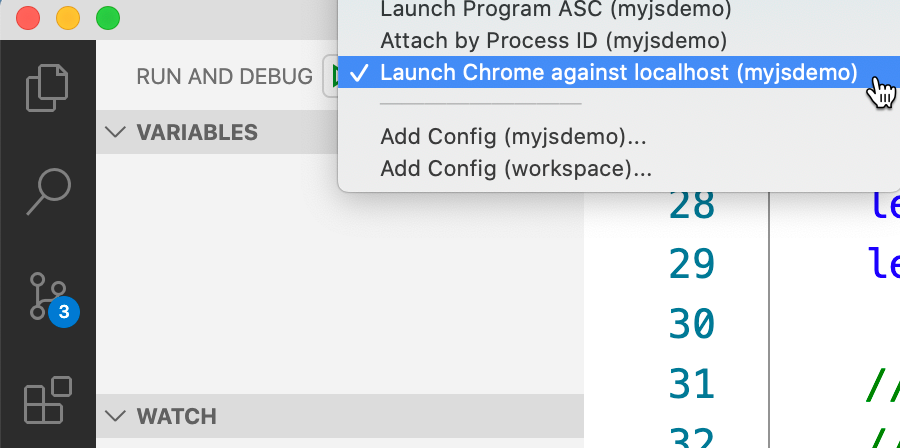

Using Visual Studio (VS) Code for Debugging and Editing

Estimated Time: 20 Minutes

Preqreusites for JavaScript debugging:

1) Install [Node.js](https://nodejs.org/en/) 

2) The Chrome debugger extension used in this Task 4, requires you to be serving your web application from local web server, which is started from either a VS Code task or from your command-line. 

VS Code is available on all major platforms including Mac, Windows, and Linux. VS Code can take on most of the tasks of an IDE with the right configuration and plugin library. [VS Code is open source](https://github.com/Microsoft/vscode).

## Step 1 Download VS Code
Download VS Code from this site https://code.visualstudio.com/Download

## Step 2 Install Extensions

Open VS Code. Go to the Extensions view (⇧⌘X).
Filter the extensions list by typing your programming language of choice, such as Java,  and you will see all related extensions.


Figure 2-1 Java Extension Pack

Java:

To help set up Java on VS Code, search for Java Extension Pack. This contains the most popular extensions for most Java developers:

* Language Support for Java(TM) by Red Hat
* Debugger for Java
* Java Test Runner
* Maven for Java
* Java Dependency Viewer
* Visual Studio IntelliCode

JavaScript:

Visual Studio Code includes built-in JavaScript IntelliSense, debugging, formatting, code navigation, refactorings, and many other advanced language features.

Python: Install [Microsoft's Python Extension](https://marketplace.visualstudio.com/items?itemName=ms-python.python)

Go: Install [Microsoft's Go Extension](https://marketplace.visualstudio.com/items?itemName=ms-vscode.Go)

C#: Install [Microsoft's C# Extension](https://marketplace.visualstudio.com/items?itemName=ms-vscode.csharp)

Extensions are available in most development languages for VS Code. See infromation about these languages including: [Java](https://code.visualstudio.com/docs/languages/java), [JavaScript](https://code.visualstudio.com/docs/languages/javascript), [Go](https://code.visualstudio.com/docs/languages/go), [Python](https://code.visualstudio.com/docs/languages/python) and [C#](https://code.visualstudio.com/docs/languages/csharp). For documentation, several other extensions are available including [Grammarly](https://marketplace.visualstudio.com/items?itemName=znck.grammarly) and [MarkDown (MD)](https://code.visualstudio.com/docs/languages/markdown). See extensions [for VS Code languages here ](https://code.visualstudio.com/docs/languages/overview).

## Step 3 Debugging with VS Code

If you are interested in setting up debugging in VS Code read this:
https://code.visualstudio.com/docs/editor/debugging

## Step 4 Debugging JavaScript with VS Code sample
 

In this step, setting up a debug session for a JavaScript code is covered for both a standalone code file as well as with a browser. The steps are similar for all languages. 

**Task 4-1 Standalone**

A) Select the Debug icon on the left 
B) Select from the drop-down menu to Add Config (for current folder)...


Figure 4-1 - Select Debug and Add Config

Select the desired debug method. Here the section is set to Node.js: Launch Program. 


Figure 4-2 - Node.js: Launch Program

VS Code stores debug configurations in a file called launch.json inside of a folder .vscode. The editor will pop up with the launch.json file.
Change the name and program to match your code file to debug.


Figure 4-3 - Configure launch.json

Here is a sample JavaScript file to test with which uses the Algorand Smart Contract Layer 1 (ASC1). Name this file ASC1.js

```JavaScript
const algosdk = require('algosdk');

//Retrieve the token, server and port values for your installation in the algod.net
//and algod.token files within the data directory or use a standup instance if available

//Hackathon TestNet
const token = "ef920e2e7e002953f4b29a8af720efe8e4ecc75ff102b165e0472834b25832c1";
const server = "http://hackathon.algodev.network";
const port = 9100;

//Recover the account

var mnemonic = "awake used crawl list cruel harvest useful flag essay speed glad salmon camp sudden ride symptom test kind version together project inquiry diet abandon budget";

var recoveredAccount = algosdk.mnemonicToSecretKey(mnemonic);
console.log(recoveredAccount.addr);
//check to see if account is valid
var isValid = algosdk.isValidAddress(recoveredAccount.addr);
console.log("Is this a valid address: " + isValid);

//instantiate the algod wrapper
let algodclient = new algosdk.Algod(token, server, port);
//submit the transaction
(async() => {
    //Get the relevant params from the algod
    let params = await algodclient.getTransactionParams();
    console.log("here" + params);
    let endRound = params.lastRound + parseInt(1000);
    let fee = await algodclient.suggestedFee();

    // create LogicSig object and sign with our secret key
    // let program = Uint8Array.from([1, 32, 1, 0, 34]);  
    // For int 1 use ASABICI=
    // int 0 => never transfer money use ASABACI=
    let program = new Uint8Array(Buffer.from("ASABICI=", "base64"));
    // makeLogicSig method takes the program and parameters
    // in this example we have no parameters
    // If we did have parameters you would add them like
    // let args = [
    //    Uint8Array.from("123"),
    //    Uint8Array.from("456")
    // ];
    // And remember TEAL parameters are order specfic
    console.log("program " + program);
    let lsig = algosdk.makeLogicSig(program);
    // sign the logic with your accounts secret
    // key. This is essentially giving your
    // key authority to anyone with the lsig
    // and if the logic returns true
    // exercise extreme care
    // If this were a escrow account usage
    // you would not do this sign operation
    lsig.sign(recoveredAccount.sk);

    // At this point you can save the lsig off and share
    // as your delegated signature.
    // The LogicSig class supports serialization and
    // provides the lsig.toByte and fromByte methods
    // to easily convert for file saving and 
    // reconstituting and LogicSig object

    //create a transaction
    let txn = {
        "from": recoveredAccount.addr,
        "to": "SOEI4UA72A7ZL5P25GNISSVWW724YABSGZ7GHW5ERV4QKK2XSXLXGXPG5Y",
        "fee": params.fee,
        "amount": 200000,
        "firstRound": params.lastRound,
        "lastRound": endRound,
        "genesisID": params.genesisID,
        "genesisHash": params.genesishashb64
    };

    // create logic signed transaction.
    // Had this been an escrow the lsig would not contain the
    // signature but would be submitted the same way
    let rawSignedTxn = algosdk.signLogicSigTransaction(txn, lsig);

    //Submit the lsig signed transaction
    let tx = (await algodclient.sendRawTransaction(rawSignedTxn.blob));
    console.log("Transaction : " + tx.txId);

})().catch(e => {
    console.log(e);
});
```

Now the debugging can start.
Select your new launch configuration form the list.


Figure 4-4 - Select the desired configuration.

Before pressing the run button, place a breakpoint in the code.

To set a breakpoint, simply click on the left margin on the line to break. 


Figure 4-5 - Set breakpoint.

Select the run icon in the debugger pane.


Figure 4-6 - Start Run and Debug.

Your breakpoint should be hit, and the program execution paused on the line of your breakpoint. It is highlighted.


Figure 4-7 - Debugging.

We are now debugging! See Figure 4-7 above.

A) Breakpoint 

B) Hover over a variable with cursor

C) See the Data Tip with the contents

D) Navigate by selecting run (to next breakpoint), step over, step into, step out of or stop 

**Task 4-2 Debug JavaScript from Chrome**

Use this task to setup debugging in a JavaScript file referenced in HTML similar to this:

```html
...
   </body>
   <script src="test.js"></script>
</html>
```
A JavaScript Webapp sample can be found here to test with: <https://github.com/algorand/js-algorand-sdk/tree/master/examples/webapp> 


Install the VS Code Extension for Debugger for Chrome. There are also VS Code Extensions for other browsers. 


Figure 4-8 - Add a Chrome debugger extension.

Note: The extension operates in two modes - it can launch an instance of Chrome navigated to your app, or it can attach to a running instance of Chrome. Using the url parameter you simply tell VS Code which URL to either open or launch in Chrome.

Create another debug configuration. This time select the Chrome: Launch option from the list. 


Figure 4-9 - Add configuration for Chrome: Launch.


Figure 4-10 - Modify the name to clarify of desired and url to include the page.

From Terminal, start your localhost in the folder where you are debugging locally.



Figure 4-11 - Start localhost

Set a breakpoint in the JavaScript code. Hit the run icon or press F5 to Launch Chrome.


 
Figure 4-12 - Launch Chrome

You should see your page open. When you Hit a breakpoint you should see the same options to debug as listed in Figure :


Resource Links: [Node.js](https://nodejs.org/en/) 


